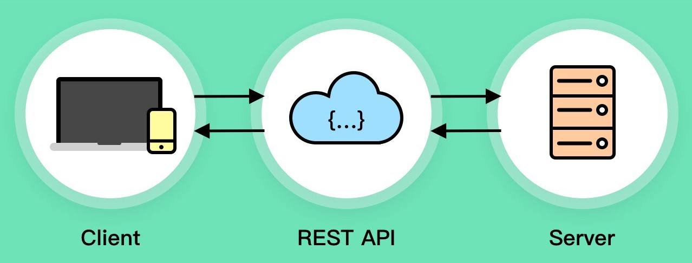

# Your Games Catalog API
RESTful API for Your Games Catalog project

# Its the beginning
Hi there, im Flou, a passionate software developer and its my first time doing this kind of full-stack project.

I'm very excited for this project and here goes some motivations and descriptions.

## Motivation
I'm already a frontend developer, but actually I'm a software developer, that was the idea whean I signed up for the University. So I decided to make a project that could cover from database and server to client.(but this repository will cover only the backend part of it, at least that is my plan right now)

## The Project
So this is an RESTful API for a new public Games Catalog based on this previous project [My Games Catalog](https://github.com/flou-ainan/my-games-catalog?tab=readme-ov-file#my-games-catalog) that lacks a backend.

The idea here is to make it the simplest way possible but includind key features as register, login and persistent data.

## Features
#### User Login and Registration
The user is able to create a free account featuring password encryption for protecting user security.\
The user is able to login and recieves a [JWT](https://jwt.io/introduction) for further requests authentication

#### Database Interactions

The `logged` user have the possibility of:

1) Add new games to the database
2) Post comments on any game
3) Edit THEIR posted games
4) Delete their comments
5) Delete their Recently posted GAMES (2 days)

Not logged users can only list games

## Technologies
- [Typescript](https://www.typescriptlang.org/) | Javascript with strong Typing features

- [Node.js](https://nodejs.org/en/about) | Javascript Runtime Environment

- [ExpressJS](https://github.com/expressjs/express?tab=readme-ov-file) | Server Framework for creating de API

- [MongoDB Atlas](https://www.mongodb.com/docs/atlas/getting-started/) | Free Cloud Well Performant DataBase

- [Render Cloud](https://docs.render.com/free) | Cloud computing solution with nice free tier.

- [Bcrypt](https://www.npmjs.com/package/bcrypt) | A Libary for password hashing

# Documentation
For further undesrtanding of the project you can go to the [DOCS](./DOCS) page. 

